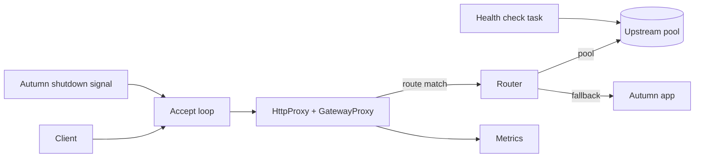

# Plan — autumn-plugin-pingora

This file records the planning phase. It uses three methods:
brainstorming, reverse brainstorming and six thinking hats.
The acceptance criteria (AC) at the end are the contract for v0.1.

Style: ASD-STE100. Short sentences. Active voice.

## 1. Goal

Run a [Pingora] reverse proxy inside an Autumn app, with one line of code:

```rust
autumn_web::app()
    .routes(routes![index])
    .plugin(PingoraPlugin::new().route(
        Route::new("billing").path_prefix("/billing").upstream("10.0.0.7:8080"),
    ))
    .run()
    .await;
```

The proxy listens on its own port. It sends matched requests to upstream
pools. It sends all other requests to the Autumn app. The plugin owns the
listener, the lifecycle, health, metrics and configuration.

[Pingora]: https://github.com/cloudflare/pingora

## 2. Brainstorming

Ideas, not filtered:

- Put Pingora in front of the Autumn app. One binary, one deploy.
- Route by path prefix to other services (API gateway, strangler fig).
- Route by host, with `*.example.com` wildcards.
- Strip the route prefix before the request goes upstream.
- Load balancing: round robin, consistent hash on client IP.
- Active TCP health checks. Skip dead upstreams.
- Retry on connect failure, on a different upstream.
- Timeouts: connect, read, write.
- `X-Forwarded-*` headers. Keep or replace the `Host` header.
- Request body limit (413).
- Connection limit.
- Autumn health indicator and Prometheus metrics.
- Graceful drain on Autumn's shutdown signal.
- `[pingora]` section in `autumn.toml`, with profiles and env overrides.
- Port 0 for tests, with a handle that gives the bound address.
- TLS termination (rustls feature). Upstream TLS.
- Response cache (`pingora-cache`).
- Rate limits (`pingora-limits`).
- Custom `ProxyHttp` filters from the app.
- Hot restart with socket hand-off.
- Service discovery (DNS, Kubernetes).

## 3. Reverse brainstorming

Question: "How can we make this plugin fail in production?"
Each answer gives a countermeasure.

| How to fail | Countermeasure |
|---|---|
| Use `Server::run_forever`. It owns the process and calls `exit`. Autumn loses control. | Do not use Pingora's `Server`. Drive `pingora_proxy::http_proxy` from our own accept loop on Autumn's runtime (ADR 0001). |
| Pingora's listening service panics when the bind fails. | Bind with tokio in the startup hook. A bind error aborts boot. |
| The port is in use, and the app boots with no proxy. | Same: bind in the startup hook. |
| A typo in `[pingora]`. Defaults apply silently. | Unknown keys and bad values abort boot. A bad env override is an error too. |
| A bad upstream address shows only at the first request. | Parse every upstream at boot. Hostnames resolve at boot. |
| `/api` matches `/apix`. Traffic goes to the wrong service. | Match prefixes on a segment boundary. Property tests. |
| Two routes have the same name. Metrics mix. | Route names must be unique. Boot stops. |
| A client sends `X-Forwarded-For: 1.2.3.4`. The upstream trusts it. | Replace client `X-Forwarded-*` values. Keep them only with `trust_forwarded_headers = true`. |
| The Autumn app sees `127.0.0.1` for every client. Rate limits break. | Warn at boot when the app does not trust the loopback proxy. |
| Fallback to the app while Autumn serves TLS. The proxy speaks plain HTTP to a TLS port. | Boot stops with a clear error. |
| The proxy bind address is the app address. Requests loop. | Boot stops with a clear error. |
| A dead upstream gets traffic. | TCP health checks on an interval. Retry the connect on another upstream. |
| All upstreams are down. Clients wait for timeouts. | Return 503 at once when no upstream is healthy. |
| A slow upstream holds connections forever. | Connect, read and write timeouts with safe defaults. |
| A huge upload fills memory or the upstream. | `max_request_body_bytes`. 413 on `Content-Length` and on streamed bodies. |
| A connection flood uses all file descriptors. | `max_connections`. The listener waits for a free slot. |
| The proxy drains after the app. Requests fail with 502. | Drain on Autumn's shutdown signal, not only in the hook. |
| Shutdown waits forever for a long download. | Drain has a grace period, fit into Autumn's shutdown budget. Then abort. |
| Health says UP while the proxy drains. The load balancer sends new traffic. | Indicator is in the readiness group. `DOWN` when not serving. |
| Attacker sends random paths. Metric labels explode. | Labels are route names from config, `fallback`, `unmatched`, and status classes. |
| Metric names start with `autumn_`. Autumn drops them. | Use the `pingora_proxy_` prefix. |
| `unwrap` or `panic!` in library code. | Clippy denies them. CI makes warnings errors. |
| Invalid lifecycle order (serve after stop). | A pure state machine owns the lifecycle. A test checks every transition. |

## 4. Six thinking hats

**White (facts).**
Pingora 0.9 is on crates.io. `pingora_proxy::http_proxy` gives an
`HttpProxy` for a custom accept loop. `Stream: From<tokio::net::TcpStream>`.
`HttpProxy::http_cleanup` stops keep-alive reuse. Static backends in
`pingora-load-balancing` are healthy until a check fails. Autumn 0.7 runs
startup hooks before it serves, and shutdown hooks after the HTTP drain.
`AppState::shutdown_token` needs the `ws` feature of `autumn-web`.
`MetricsSource` supports counters and gauges only. `TestApp` runs startup
hooks, not shutdown hooks. Pingora supports Unix first.

**Red (feelings).**
Install with one line, as other Autumn plugins do. The proxy must not
surprise: an unmatched request reaches the app as before. Operators must
trust the health signal and the metrics.

**Black (risks).**
Pingora is pre-1.0; its API changes. It pulls many crates (compile time).
The config loader copies core logic and can drift. Two ports need two
firewall rules. No TLS in v0.1, so the proxy must sit behind a TLS
terminator or on a private network.

**Yellow (benefits).**
One process for app and gateway. Pingora's connection pooling and
retries. Move old services behind the Autumn app one prefix at a time.
One readiness signal for app and proxy.

**Green (creative).**
Fallback to the app with zero routes: an in-process edge. Declare the
proxied prefixes to `autumn routes`, so the route audit sees them. A
`PingoraHandle` for port-0 tests and manual drain. Pure modules (router,
forwarded headers, lifecycle) with property tests.

**Blue (process).**
Decisions:

1. Own accept loop on Autumn's tokio runtime (ADR 0001).
2. Scope: routes, load balancing, health checks, retries, timeouts,
   forwarded headers, body and connection limits, app fallback, health
   indicator, metrics, lifecycle, config, route declarations.
3. Out of scope for v0.1: TLS (down- and upstream), cache, rate limits,
   custom filters, hot restart, service discovery. Record as follow-ups.
4. Work in RED → GREEN → REFACTOR order, in two slices: pure core, then
   the running proxy.
5. After the build, review with agents from several angles. Fix the
   findings.

## 5. Acceptance criteria

| ID | Criterion |
|---|---|
| AC1 | `PingoraPlugin::new().route(..)` runs a Pingora reverse proxy on a dedicated listener. An empty `bind` gives `127.0.0.1:8080` in `dev`/`test` and `0.0.0.0:8080` in other profiles. |
| AC2 | Configuration comes from `[pingora]` in `autumn.toml`, with profile layering and `AUTUMN_PINGORA__*` env overrides for scalar keys. Code applies on top. Invalid configuration aborts boot with a clear message. |
| AC3 | Routing: host (exact or `*.` wildcard) and path prefix on a segment boundary. The longest prefix wins. A host route wins over an any-host route. `strip_prefix` removes the prefix. Unmatched requests go to the Autumn app (`fallback = "app"`) or get 404 (`fallback = "none"`). |
| AC4 | Each route has a pool with `round_robin` (default) or `consistent` (client IP) selection. TCP health checks run on an interval. No healthy upstream gives 503. |
| AC5 | A connect failure retries on another upstream, up to `max_retries`. Connect, read and write timeouts apply. |
| AC6 | The proxy sets `X-Forwarded-For`, `X-Forwarded-Proto` and `X-Forwarded-Host`. It replaces client values unless `trust_forwarded_headers = true`. It keeps the client `Host` unless the route sets `upstream_host`. |
| AC7 | `max_request_body_bytes` gives 413. `max_connections` limits open connections. |
| AC8 | The plugin reports to Autumn: a `pingora` readiness indicator (UP only while serving) and `pingora_proxy_*` metrics with bounded labels. A `PingoraHandle` is in `AppState`. |
| AC9 | A pure lifecycle state machine has all transitions tested. A bind failure aborts boot. Shutdown starts on Autumn's shutdown signal or the hook: stop accepting, end keep-alive, drain for `shutdown_grace_ms`, then abort. Shutdown is idempotent. |
| AC10 | Boot stops when the fallback target uses TLS or when the proxy address is the app address. Boot warns when the app does not trust the loopback proxy. |
| AC11 | The plugin passes Autumn's conformance harness. It declares `[pingora]` and its proxied prefixes, and has a stable `name()`. |
| AC12 | Quality gates: `cargo fmt`, clippy pedantic + nursery with `-D warnings`, no `unwrap` in library code, line coverage ≥ 85 %, CI workflow, README, CLAUDE.md, ADRs, a runnable example. Docs use ASD-STE100. |

## 6. Design



Modules:

- `lifecycle` — pure state machine.
- `config` — `[pingora]` config, loader and validation.
- `router` — pure route match and prefix strip.
- `forwarded` — pure `X-Forwarded-*` rules.
- `upstream` — pools, selection, health checks.
- `proxy` — the `ProxyHttp` implementation.
- `server` — accept loop, connection limit, drain, `PingoraHandle`.
- `metrics`, `health` — actuator parts.
- `plugin` — the builder and the Autumn `Plugin` implementation.
